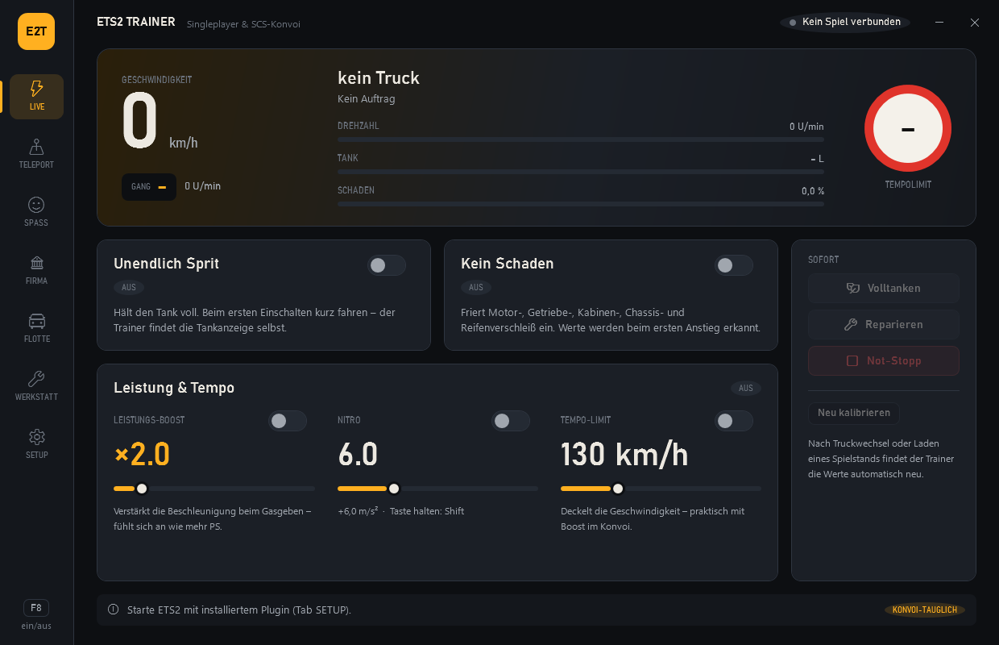
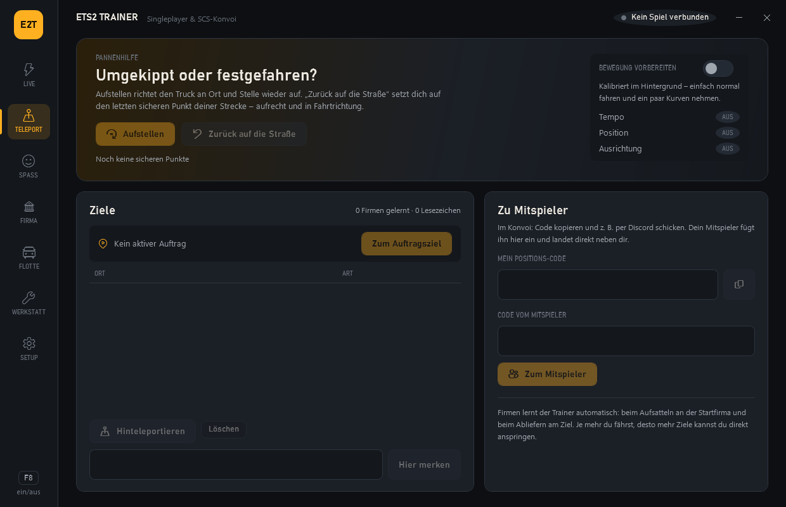
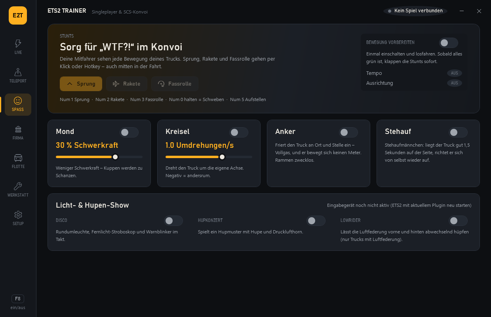
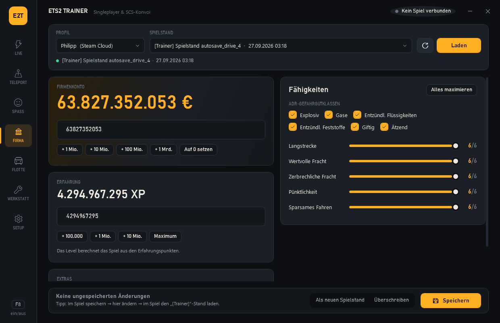
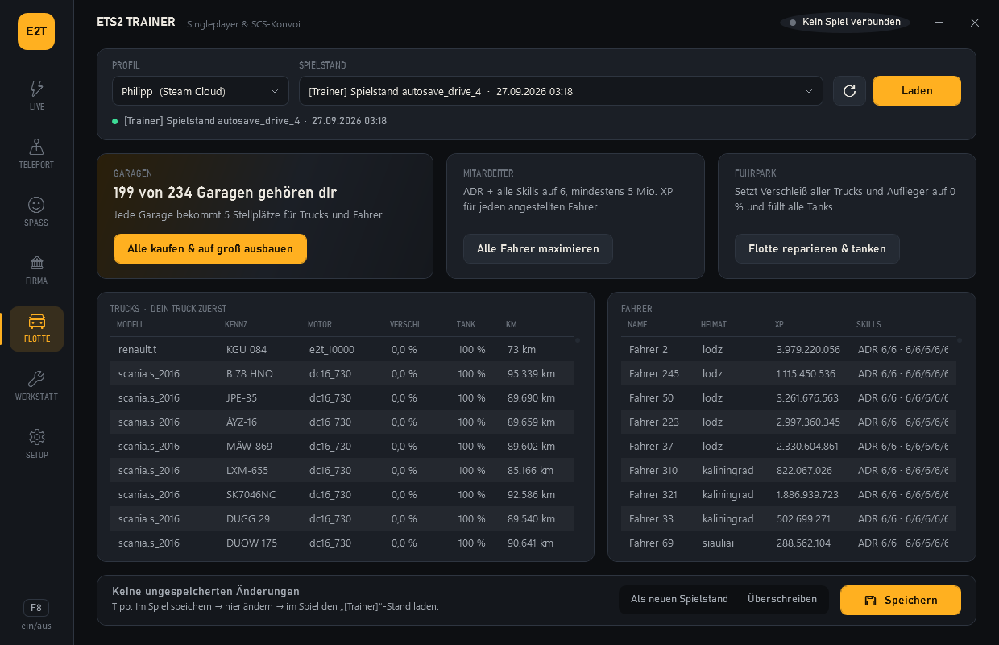
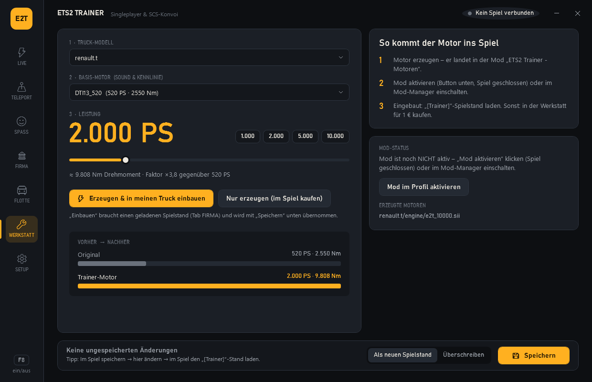
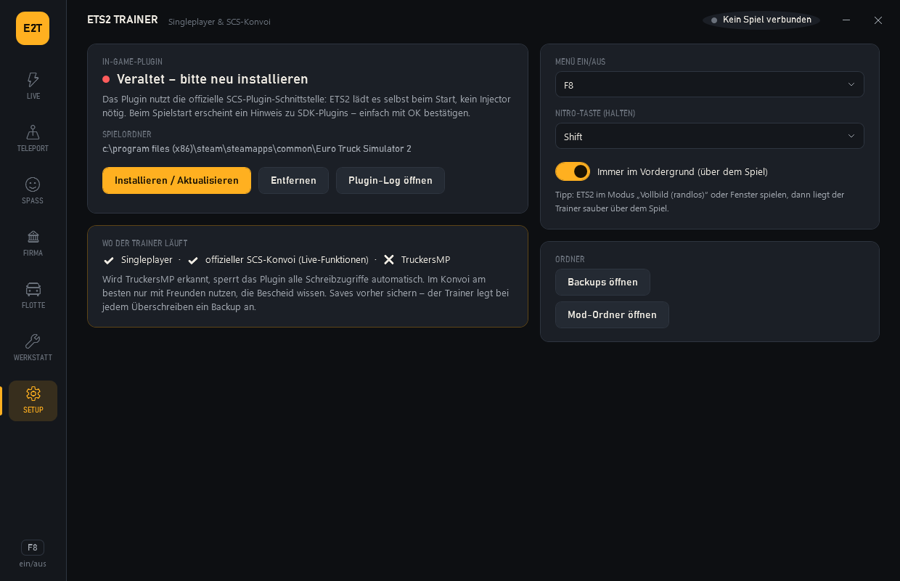

# ETS2 Trainer

Mod-Menü / Trainer für **Euro Truck Simulator 2** – Live-Cheats über ein offizielles SCS-SDK-Plugin,
Teleport & Pannenhilfe, Spaß-Stunts für den Konvoi, ein Spielstand-Editor und ein Motor-Generator mit
frei wählbarer PS-Zahl.


> Gedacht für **Singleplayer und offizielle SCS-Konvois** – **nicht für TruckersMP**
> (dort erkennt und sperrt sich das Plugin selbst).



## Was es kann

| Bereich | Funktion | Wie | Im Konvoi? |
|---|---|---|---|
| **LIVE** | Unendlich Sprit, Volltanken | In-Game-Plugin, Auto-Kalibrierung | ✔ |
| | Kein Schaden, Sofort-Reparatur | In-Game-Plugin | ✔ |
| | Leistungs-Boost ×1–×10, Nitro-Taste, Tempo-Limit, Not-Stopp | In-Game-Plugin (Geschwindigkeitsvektor) | ✔ |
| | Instrumente: Tempo, Gang, Drehzahl, Tank, Schaden, Tempolimit, Auftrag | Offizielle SCS-Telemetrie | ✔ |
| **TELEPORT** | Aufstellen (umgekippt), Zurück auf die Straße (festgefahren), Teleport zu Auftragsziel, gelernten Firmen, Lesezeichen, Mitspieler (Positions-Code) | In-Game-Plugin (Position + Ausrichtung) | ✔ |
| **SPASS** | Sprung, Rakete, Fassrolle, Schweben, Mond-Schwerkraft, Kreisel, Anker, Stehaufmännchen, Disco-Licht, Hupkonzert, Lowrider | In-Game-Plugin + SCS-Input-SDK | ✔ |
| **FIRMA** | Firmenkonto, Erfahrung, ADR-Klassen, alle Skills, Kredite tilgen, Städte besuchen | Spielstand-Editor | vorher |
| **FLOTTE** | Alle Garagen kaufen + auf groß ausbauen, alle Fahrer maximieren, Flotte reparieren + tanken | Spielstand-Editor | vorher |
| **WERKSTATT** | Eigene Motoren mit frei wählbarer PS-Zahl (Sound/Kennlinie vom Original), direkt einbauen | Mod-Generator + Spielstand | vorher* |
| **SETUP** | Plugin installieren, Menü-Taste (F8), Nitro-Taste, Backups | – | – |

\* Im Konvoi müssen Mods ggf. zur Session passen – der Motor-Mod ist eine normale lokale Mod.

## Screenshots

| | |
|---|---|
|  **TELEPORT** – Pannenhilfe, Ziele, Mitspieler |  **SPASS** – Stunts & Licht-/Hupen-Show |
|  **FIRMA** – Konto, XP, ADR, Skills |  **FLOTTE** – Garagen, Fahrer, Trucks |
|  **WERKSTATT** – Motor mit Wunsch-PS |  **SETUP** – Plugin, Tasten, Ordner |

## Schnellstart

1. `build.cmd` ausführen (braucht Visual Studio mit C++-Workload und das .NET 8 SDK) → `dist\ETS2Trainer\ETS2Trainer.exe`
2. Trainer starten → **SETUP → Installieren / Aktualisieren** (ETS2 dabei geschlossen)
3. ETS2 starten, den Hinweis „SDK-Plugins“ mit **OK** bestätigen
4. Trainer-Fenster über dem Spiel mit **F8** ein-/ausblenden (ETS2 am besten im Modus *Vollbild randlos* oder *Fenster*)

## Bedienung

### LIVE (funktioniert auch im Konvoi)
Funktion einschalten und losfahren. Das Plugin findet die nötigen Speicherstellen **selbst** („Auto-Kalibrierung“):
es vergleicht den Arbeitsspeicher mit den offiziellen Telemetrie-Werten, bis nur noch die echte Stelle übrig ist, und
prüft sie mit einem kleinen Test-Schreibzugriff. Dadurch gibt es **keine festen Adressen**, die nach Spiel-Updates kaputtgehen.

- **Sprit:** kurz fahren, bis sich der Tankinhalt ändert → Chip wird grün „AKTIV“.
- **Schaden:** jeder Verschleißwert wird erkannt, sobald er sich einmal ändert (Werte, die bei 0 stehen, brauchen einen ersten Kratzer).
- **Boost/Nitro/Limit:** ab ca. 20 km/h fahren; der Truck wird bei der Kalibrierung kurz minimal angeschoben.
- Nach Truckwechsel/Laden: **Neu kalibrieren** (passiert meist automatisch).
- Schließt du den Trainer, schaltet das Plugin nach 3 Sekunden alle Funktionen ab.

### TELEPORT
Einmal **Bewegung vorbereiten** einschalten und normal fahren (ein paar Kurven) – dann werden Tempo, Position und
Ausrichtung kalibriert (Chips werden grün). Danach:

- **Aufstellen** (Num 5): richtet den Truck an Ort und Stelle auf.
- **Zurück auf die Straße**: setzt dich auf den letzten sicheren Punkt deiner Strecke (das Plugin merkt sich alle 25 m einen, solange der Truck gerade steht).
- **Zum Auftragsziel**: klappt, sobald die Zielfirma einmal gelernt wurde. Firmen lernt der Trainer automatisch beim Aufsatteln
  an der Startfirma und beim Abliefern. Eigene Orte mit **Hier merken** speichern.
- **Zu Mitspieler**: Positions-Code kopieren (z. B. per Discord schicken); der Mitspieler fügt ihn ein und landet neben dir.
  Beide brauchen den Trainer.
- Ein beliebiger Punkt auf der Karte geht nicht: das Spiel gibt Kartenklicks/GPS-Ziele nicht an Plugins weiter.

### SPASS (sieht im Konvoi jeder)
Stunts: **Sprung** (Num 1), **Rakete** (Num 2), **Fassrolle** (Num 3), **Schweben** (Num 0 halten).
Dauer-Effekte: Mond-Schwerkraft, Kreisel, Anker, Stehaufmännchen. Licht-/Hupen-Show (Disco, Hupkonzert, Lowrider) läuft über
ein eigenes Eingabegerät des Plugins – beim ersten Start nach dem Update ETS2 einmal neu starten.

### FIRMA / FLOTTE (Spielstand-Editor)
1. Im Spiel speichern (oder Autosave nutzen)
2. Profil + Spielstand wählen → **Laden**
3. Werte ändern / Aktionen klicken → **Speichern**
   - *Als neuen Spielstand* (empfohlen): Original bleibt unberührt, der neue Stand heißt **„[Trainer] …“**
   - *Überschreiben*: vorher wird automatisch ein Backup nach `Dokumente\Euro Truck Simulator 2\ets2_trainer_backups` gelegt
4. Im Spiel den „[Trainer]“-Stand laden

Geschrieben wird im Klartext-SII-Format, das ETS2 selbst lesen kann.

**Steam-Cloud-Profile:** ETS2 liest diese Spielstände über Steam – von außen geschriebene Dateien zeigt das Spiel nicht an.
Deshalb schreibt der Trainer solche Stände **über das Plugin im laufenden Spiel** (Steam Remote Storage):
ETS2 starten (Hauptmenü reicht), im Trainer speichern, im Spiel **Laden** öffnen (war das Menü schon offen: einmal schließen
und neu öffnen). So lässt sich ein Stand auch „live“ überschreiben und sofort laden.

### WERKSTATT (PS frei wählen)
1. Truck-Modell + Basis-Motor wählen (der Basis-Motor liefert Sound, Drehmomentkurve und Emblem)
2. PS per Regler wählen (100 – 10.000) → **Erzeugen & in meinen Truck einbauen** → unten **Speichern**
3. Einmalig **Mod im Profil aktivieren** (Spiel geschlossen) oder im Mod-Manager „ETS2 Trainer - Motoren“ einschalten

Alternativ „Nur erzeugen“: der Motor ist dann in der Werkstatt für 1 € kaufbar.

## Wie es funktioniert

```
ETS2 ──SDK──▶ ets2_trainer.dll ◀──Shared Memory──▶ ETS2Trainer.exe ──▶ Spielstände / Mods
               (Kalibrierung,                        (WPF-Oberfläche,
                Live-Cheats,                          Spielstand-Editor,
                Steam-Cloud-Schreiben)                Motor-Generator)
```

- **Plugin statt Injector:** ETS2 lädt die DLL selbst über die offizielle SCS-Plugin-Schnittstelle.
- **Telemetrie als Orakel:** Das SDK meldet Werte (Tank, Tempo, Position …) nur lesend. Das Plugin sucht
  diese Werte im Speicher, filtert, während sie sich ändern, und bestätigt die echte Stelle mit einem kurzen
  Test-Schreibzugriff. Die Scans laufen im Hintergrund, das Spiel ruckelt nicht.
- **Spielstände:** ScsC (AES + zlib) → BSII/Text werden gelesen, geschrieben wird verlustfrei als Text-SII.
- **Motoren:** Die Original-Definitionen kommen direkt aus den Spielarchiven (HashFS v2) und werden skaliert.

Ausführlich – Protokoll-Layout, Kalibrier-Zustandsmaschine, Sicherheits-Gates, Dateiformate,
Erweitern: **[docs/TECHNICAL.md](docs/TECHNICAL.md)**

## Sicherheit & Grenzen

- **TruckersMP:** wird erkannt (`core_ets2mp.dll`) → alle Schreibzugriffe gesperrt.
- **World of Trucks:** Aufträge mit aktiven Cheats nicht abgeben.
- Live-Funktionen hängen von der Auto-Kalibrierung ab. Klappt sie nicht, zeigt der Chip „FEHLGESCHLAGEN“ und das Plugin-Log
  (`Dokumente\Euro Truck Simulator 2\ets2_trainer_plugin.log`, SETUP → Plugin-Log öffnen) sagt warum.
- Der Boost wirkt auf den Geschwindigkeitsvektor (physikalisch „mehr Schub“), nicht auf das Motor-Datenblatt. Für echte PS-Werte die Werkstatt nutzen.
- Das Plugin schreibt nur in normale Daten-Seiten des Spiels und nur, solange der Trainer läuft (Heartbeat).

## Entwicklung

```
shared/bridge_protocol.h     Shared-Memory-Vertrag Plugin <-> App (Layout per static_assert fixiert)
src/plugin/                  C++ SCS-Plugin (Kalibrierung, Live-Cheats, Bewegung, Cloud-Saves, Selbsttest)
src/Ets2Trainer.Core/        SII (ScsC/BSII/Text), HashFS v2 + CityHash, Save-Editor, Motor-Mod, Bridge-Client, Teleport-Ziele
src/Ets2Trainer.App/         WPF-Oberfläche (MVVM ohne Bibliothek, eigenes Theme)
src/Ets2Trainer.Tests/       Test-Runner ohne NuGet-Abhängigkeiten (liest echte Saves nur lesend)
docs/                        Technische Dokumentation + Screenshots
build.cmd                    Plugin + Tests + App -> dist\ETS2Trainer
```

| Befehl | Zweck |
|---|---|
| `build.cmd` | alles bauen, alle Tests laufen lassen, `dist\ETS2Trainer` erzeugen |
| `src\plugin\build.cmd test` | nur Plugin + Selbsttest (simuliertes Spiel, 23 Szenarien) |
| `dotnet run --project src/Ets2Trainer.Tests -c Release` | C#-Tests |
| `ETS2Trainer.exe --screenshot <ordner> [--load]` | alle Tabs als PNG rendern (offline, liest Spielstände nur) |

## Haftungsausschluss

Inoffizielles Fan-Projekt, nicht verbunden mit SCS Software. Benutzung auf eigene Gefahr – vor dem Überschreiben
von Spielständen legt der Trainer Backups an, trotzdem gilt: wichtige Spielstände vorher sichern.
