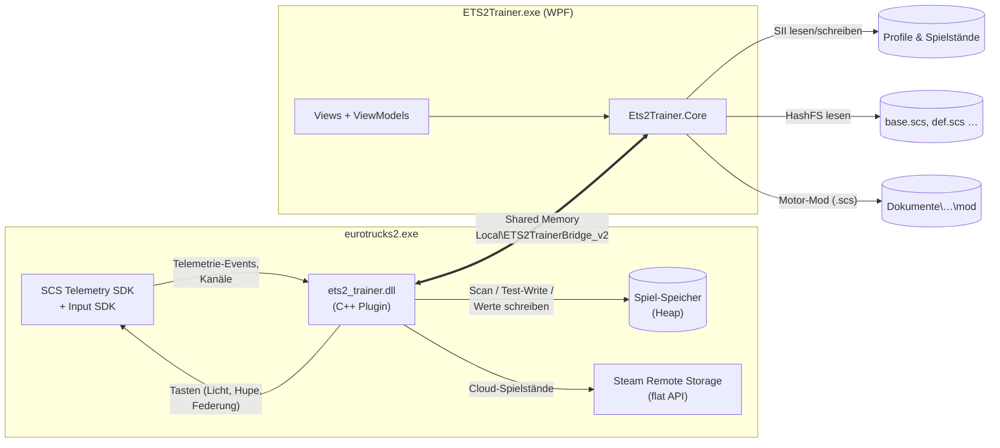
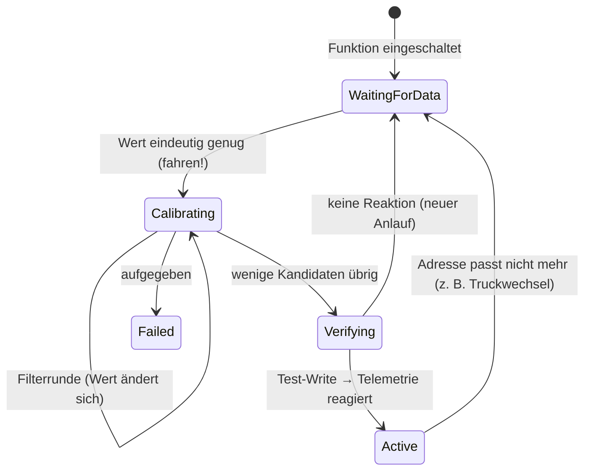

# Technische Dokumentation

Dieses Dokument beschreibt, wie der ETS2 Trainer intern funktioniert: Aufbau, Datenfluss, das
Shared-Memory-Protokoll, die Auto-Kalibrierung, Spielstand-Formate und wie man das Projekt erweitert.
Für Bedienung und Installation siehe [README](../README.md).

- [1. Architektur](#1-architektur)
- [2. Komponenten](#2-komponenten)
- [3. Bridge-Protokoll (Plugin ↔ App)](#3-bridge-protokoll-plugin--app)
- [4. Auto-Kalibrierung („Telemetrie als Orakel“)](#4-auto-kalibrierung-telemetrie-als-orakel)
- [5. Live-Funktionen](#5-live-funktionen)
- [6. Bewegung, Teleport & Tricks](#6-bewegung-teleport--tricks)
- [7. Sicherheits-Gates](#7-sicherheits-gates)
- [8. Spielstände](#8-spielstände)
- [9. Werkstatt: Motor-Mod-Generator](#9-werkstatt-motor-mod-generator)
- [10. Tests, Build & Entwickler-Werkzeuge](#10-tests-build--entwickler-werkzeuge)
- [11. Erweitern](#11-erweitern)

---

## 1. Architektur

Zwei Prozesse, eine klare Trennung:

| Teil | Läuft in | Aufgabe |
|---|---|---|
| **Plugin** (`src/plugin`) | ETS2-Prozess, Spiel-Thread + Hintergrund-Scan-Threads | Telemetrie empfangen, Speicher kalibrieren, Live-Cheats pro Frame anwenden, Cloud-Spielstände schreiben |
| **App** (`src/Ets2Trainer.App` + `Core`) | eigener Prozess | Oberfläche, Spielstand-Editor, Motor-Mod-Generator, Plugin-Installation, steuert das Plugin über die Bridge |

Das Plugin wird über die **offizielle SCS-Plugin-Schnittstelle** geladen (DLL in
`bin\win_x64\plugins`). Es gibt keinen Injector und keine festen Speicheradressen.

## 2. Komponenten

### Plugin (C++17, MSVC, `/W4`, ohne Abhängigkeiten)

| Datei | Inhalt |
|---|---|
| `plugin.cpp`, `plugin_telemetry.*` | SDK-Einstieg (`scs_telemetry_init/shutdown`, `scs_input_init/shutdown`), Kanal-/Event-Registrierung → `TelemetryState` |
| `bridge.*` | Shared-Memory-Mapping, Seqlock-Schreiben von Telemetrie/Status, Lesen der Control-Sektion |
| `trainer.*` | Frame-Schleife, Sicherheits-Gates, Befehlsverarbeitung, Lebenszyklus der Hintergrund-Scans |
| `trainer_features.cpp` | Befehle (Tanken, Reparieren, Stopp, Teleport, Aufstellen, Tricks, Spielstand schreiben) |
| `trainer_motion.cpp` | Bewegungs-Skripte, Brotkrumen, Tricks, Physik-Spielereien, Licht-/Hupen-Show |
| `trainer_status.cpp` | Status-Sektion füllen (Feature-Zustände, Fähigkeiten, Zähler, Meldung) |
| `calibration*.{h,cpp}` | Kalibratoren: Skalar (Tank, Verschleiß), Geschwindigkeitsvektor, Position, Ausrichtung |
| `mem_scan.*`, `async_scan.*` | Paralleler Speicherscan (Bereichs-/Wert-Ziele), Hintergrund-Ausführung mit Abbruch |
| `mem_access.*` | SEH-geschützte Lese-/Schreibzugriffe, Seitenfilter |
| `cloud_storage.*` | Spielstand-Dateien über `ISteamRemoteStorage` (Flat API) im Spielprozess schreiben |
| `input_device.*` | Semantisches Eingabegerät „ets2_trainer“ über das SCS Input SDK |
| `platform*.{h,cpp}` | Abstraktion von Zeit, Tastatur, Fokus, Prozess-Modulen (im Selbsttest gefälscht) |
| `tests/` | Selbsttest gegen ein simuliertes Spiel (`FakeGame`) |

### Core (.NET 8, ohne NuGet-Pakete)

| Namespace | Inhalt |
|---|---|
| `Bridge` | `BridgeProtocol` (C#-Spiegel von `bridge_protocol.h`), `BridgeClient` (Mapping öffnen, Seqlock lesen, Control schreiben, Befehle senden) |
| `Sii` | Container-Erkennung, ScsC-Entschlüsselung, BSII-Decoder, Text-Parser/-Writer, Wert-Konvertierungen |
| `Save` | `SaveGame` (typisierte Edits), `SaveSlotService` (Slots listen/laden/schreiben, Backups), `CloudSaveStager` |
| `HashFs` | HashFS-v2-Reader, CityHash64, `GameFileSystem` (Vereinigung aller Spielarchive) |
| `Mods` | `EngineModBuilder` (Motor-Definitionen skalieren), `TrainerModPackage` (Mod-Paket + Profil-Aktivierung) |
| `Game` | Pfade/Profile, Plugin-Installer, Teleport-Ziele (`PlacesStore`, `PositionCode`) |

### App (WPF, MVVM ohne Bibliothek)

`MainViewModel` hält die Unter-ViewModels und einen 10-Hz-`DispatcherTimer`, der pro Tick
`Live.Tick()` (Bridge lesen/schreiben), `Teleport.Tick()` (Ziele lernen) und `Fun.Tick()` aufruft.
Die Views sind reine XAML-Oberflächen mit einem eigenen Theme (`Themes/Theme.xaml`).

## 3. Bridge-Protokoll (Plugin ↔ App)

Ein benanntes Shared-Memory-Objekt `Local\ETS2TrainerBridge_v2`, **1152 Bytes**, angelegt vom Plugin.
Das Layout ist in `shared/bridge_protocol.h` definiert und per `static_assert` festgenagelt; der
C#-Spiegel `BridgeProtocol.cs` wird durch einen Layout-Test geprüft.

| Offset | Größe | Sektion | Schreiber → Leser |
|---:|---:|---|---|
| 0 | 16 | Kopf (Magic `E2TB`, Version 2, Größe) | Plugin → App |
| 16 | 616 | Telemetrie (Position, Ausrichtung, Tempo, Gang, Drehzahl, Tank, Verschleiß, Auftrag inkl. Firmen-/Stadt-IDs, Flags) | Plugin → App |
| 632 | 384 | Status (Heartbeat, Feature-Zustände, aktive Funktionen, Fähigkeiten, Zähler, Befehlsquittungen, Meldung) | Plugin → App |
| 1016 | 136 | Control (Schalter, Faktoren, Tasten, Befehl + 6 Argumente) | App → Plugin |

**Konsistenz:** Die Telemetrie wird per **Seqlock** geschrieben: das Plugin setzt `seqBegin`, schreibt
den Inhalt und setzt dann `seqEnd` auf dieselbe Nummer. Die App liest erneut, bis beide gleich sind.
Befehle liest das Plugin nur, wenn sich `commandSeq` während des Kopierens nicht geändert hat.

**Befehle** laufen über `commandSeq` + `commandType` + `commandArgs[6]`. Das Plugin führt jede neue
Sequenznummer genau einmal aus und quittiert sie in `Status.lastCommandAck`.

| # | Befehl | Argumente |
|---:|---|---|
| 1 | Refuel | – |
| 2 | Repair | – |
| 3 | StopTruck | – |
| 4 | Recalibrate | `args[0]` = Bitmaske: 1 Tank, 2 Verschleiß, 4 Tempo, 8 Position, 16 Ausrichtung |
| 5 | Teleport | x, y, z, Richtung (0–1 Umdrehung), hatRichtung |
| 6 | ResetAll | – |
| 7 | Unflip | – |
| 8 | ReturnToRoad | – |
| 9 | Jump | `args[0]` = Steiggeschwindigkeit (m/s, optional) |
| 10 | Rocket | – |
| 11 | BarrelRoll | – |
| 12 | WriteSaveFiles | – (liest die Anfrage-Datei, siehe [8.4](#84-steam-cloud-spielstände)) |

**Feature-Zustände** (pro kalibrierter Größe): `Off → WaitingForData → Calibrating → Verifying →
Active`, bei Problemen `Failed` (mit Meldung) oder `Blocked` (Sicherheits-Gate).

**Versionierung:** Jede Layout-Änderung erhöht `kBridgeVersion` und ändert den Mapping-Namen – alte
Apps verbinden sich so nie mit neuen Plugins (und umgekehrt).

## 4. Auto-Kalibrierung („Telemetrie als Orakel“)

Das SDK liefert Werte nur **lesend**. Um sie zu verändern, sucht das Plugin die Stelle im
Arbeitsspeicher, an der das Spiel denselben Wert hält – ohne feste Adressen, damit Spiel-Updates
nichts kaputtmachen.

1. **Scan** – durchsucht alle `MEM_COMMIT | MEM_PRIVATE | PAGE_READWRITE`-Seiten des Spiels parallel
   (Hintergrund-Threads mit niedriger Priorität, halbe Kernzahl). Das Spiel läuft währenddessen
   weiter: Die Suchbereiche (`LiveBounds`) werden jeden Frame auf alle seit Scan-Start gesehenen
   Telemetriewerte erweitert, plus eine Vorhersage-Reserve (3 Frames × letzte Änderung).
2. **Sofortfilter** – nach dem Scan bleiben nur Treffer, die jetzt exakt/tolerant zum aktuellen Wert passen.
3. **Filterrunden** – immer wenn sich der Telemetriewert spürbar ändert, müssen sich die Kandidaten
   gleich ändern. Konstante oder fremde Werte fallen raus.
4. **Verifikation** – die wenigen Übrigen werden **gemeinsam kurz verändert** (z. B. Tempo ×1,1);
   reagiert die Telemetrie im nächsten Frame entsprechend, ist die Stelle bestätigt. Der Originalwert
   wird sonst sofort zurückgeschrieben.
5. **Validierung** – bestätigte Adressen werden jeden Frame gegengeprüft; nach einigen Fehlschlägen
   wird neu kalibriert (Truckwechsel, Spielstand geladen, Speicher umgezogen).

| Größe | Suchziel | Besonderheiten |
|---|---|---|
| Tank, Verschleiß | `float`/`double`-Wert bzw. -Bereich | Verschleiß-Kanäle einzeln, sobald sie sich einmal ändern |
| Geschwindigkeit | Vektor (3×`float` oder 3×`double`) mit Betrag ≈ Tempo | überlappende Fenster werden aussortiert (16-Byte-Ausrichtung bevorzugt); Treffer im eigenen Kandidaten-Puffer werden verworfen (sonst verfolgen sie sich selbst) |
| Position | 3×`double` in einer Box um die Telemetrie-Position | Toleranz wächst mit dem Tempo |
| Ausrichtung | nahe der bestätigten Position (±1024 Bytes) | Quaternion (xyzw/wxyz, auch konjugiert), 3×3-/4×4-Matrizen (Zeilen/Spalten), Vorzeichen-Varianten für Nick/Roll; Bestätigung durch +5°-Gier-Test |

## 5. Live-Funktionen

Jeden Frame, nur bei offenem Gate (siehe [7](#7-sicherheits-gates)):

- **Unendlich Sprit** – schreibt den vollen Tankwert an die bestätigte(n) Adresse(n).
- **Kein Schaden** – jeder bestätigte Verschleißwert darf nicht über den Wert beim Einschalten steigen
  (Auflieger-Kanäle nur mit angehängtem Auflieger).
- **Leistungs-Boost** – verstärkt beim Gasgeben den Geschwindigkeitszuwachs um den Faktor
  (×1–×10); wirkt physikalisch wie mehr Schub.
- **Nitro** – solange die Taste gehalten wird *und* ETS2 den Fokus hat: zusätzliche Beschleunigung.
- **Tempo-Limit** – skaliert den Geschwindigkeitsvektor auf das Limit herunter.
- **Tanken/Reparieren/Stopp** – einmalige Befehle.

## 6. Bewegung, Teleport & Tricks

Alle Bewegungsfunktionen benötigen die kalibrierten Größen Geschwindigkeit, Position und Ausrichtung
(Schalter „Bewegung vorbereiten“ = `Control.prepareMotion`).

- **Halte-Skripte:** Teleport schreibt Position (+0,4 m Höhe) und optional die Richtung und hält sie
  einige Frames lang, bis die Physik sich beruhigt hat (Geschwindigkeit wird dabei genullt).
- **Aufstellen:** setzt Nick/Roll auf 0 und behält die Richtung bei.
- **Zurück auf die Straße:** Ringpuffer mit 64 „Brotkrumen“ – alle 25 m ein Punkt, aber nur, wenn der
  Truck gerade steht (Neigung < 0,03 Umdrehungen). Teleportiert zum letzten Punkt mit dessen Richtung.
- **Tricks:** Sprung, Rakete, Fassrolle (Skript, danach Aufrichten), Schweben (Taste halten),
  Mond-Schwerkraft (Gegenkraft zur Schwerkraft), Kreisel, Anker (Position einfrieren),
  Stehaufmännchen (liegt der Truck ≥ 1,5 s auf der Seite und ist langsam → Aufstellen, 5 s Abklingzeit).
  Ob Geschwindigkeiten in Welt- oder Fahrzeug-Koordinaten liegen, erkennt das Plugin per Abstimmung.
- **Licht-/Hupen-Show:** über das Input SDK meldet das Plugin ein eigenes Gerät an und „drückt“
  Spiel-Steuerungen (`beacon`, `hblight`, `flasher4way`, `horn`, `airhorn`, `frontsuspup/dwn`,
  `rearsuspup/dwn`, …). Beim Ausschalten werden Schalter wieder in den Ausgangszustand gebracht.

**Teleport-Ziele (App):** `PlacesStore` speichert Ziele als JSON in `%AppData%\ETS2Trainer\places.json`.
Firmen werden automatisch gelernt:

- **Start-Firma:** nach einem neuen Auftrag (Zähler `jobStartedCount`), sobald ein Auflieger
  angehängt ist – Freight-Market-Aufträge beginnen irgendwo, der Truck ist erst beim Aufsatteln an der Firma.
- **Ziel-Firma:** beim Event `job.delivered` (Zähler `jobDeliveredCount`) mit den zuletzt gesehenen Ziel-IDs.

Positions-Codes für „zu Mitspieler“: `ETS2T:x;y;z;richtung` (invariante Kultur, 2 bzw. 4 Nachkommastellen).

## 7. Sicherheits-Gates

Das Plugin schreibt nur, wenn alle Gates offen sind:

| Gate | Bedingung | Folge |
|---|---|---|
| **TruckersMP** | `core_ets2mp.dll` im Prozess (Prüfung beim Start und alle 5 s) | alle Schreibfunktionen gesperrt, Flag in der Telemetrie, App zeigt Warnung |
| **App-Heartbeat** | App hat die Control-Sektion > 3 s nicht aktualisiert | alle Funktionen aus (Trainer geschlossen/abgestürzt) |
| **Kein Truck** | keine Truck-Konfiguration | Live-Funktionen pausiert (Spielstand-Schreiben geht trotzdem, z. B. im Hauptmenü) |

Zusätzlich:

- Schreibzugriffe nur auf private, committete `PAGE_READWRITE`-Seiten, nie ins eigene Modul oder
  den eigenen Stack.
- Alle Fremdzugriffe laufen SEH-geschützt.
- Die Befehlsargumente werden geprüft (endliche Koordinaten, Grenzen).

## 8. Spielstände

### 8.1 Formate
`SiiFile` erkennt den Container an den ersten 4 Bytes:

| Signatur | Format | Behandlung |
|---|---|---|
| `ScsC` | verschlüsselt: AES-256-CBC (im Spiel fest hinterlegter Schlüssel) + zlib | entschlüsseln, entpacken, Inhalt erneut erkennen |
| `BSII` | binäres SII (Struktur-Definitionen + Datenblöcke) | `BsiiDecoder` → `SiiDocument` |
| `SiiN` | Text-SII | `SiiTextParser` |

Geschrieben wird immer **Text-SII** (`SiiTextWriter`), das ETS2 selbst lädt: Floats exakt als
`&hex`, `nil`, Escape `\xHH` für Nicht-ASCII, indizierte Arrays (`name: 2`, `name[0]: …`).
Der Test `RealSave_DecodesAndRoundTripsLosslessly` prüft das an echten Spielständen verlustfrei.

### 8.2 Edits
`SaveGame` bietet typisierte Operationen auf dem Dokument: Geld, Erfahrung (auf `uint32` begrenzt),
ADR/Skills, Kredite tilgen, Städte besuchen, Garagen kaufen/ausbauen, Fahrer maximieren,
Flotte reparieren/tanken, Motor einbauen.

### 8.3 Schreiben (lokale Profile)
`SaveSlotService.Write`:

- **Neuer Slot:** nächster freier nummerierter Ordner. Zusatzdateien werden kopiert, `info.sii` wird
  mit „[Trainer] …“ benannt. Das Original bleibt unberührt.
- **Überschreiben:** vorher Backup nach `Dokumente\Euro Truck Simulator 2\ets2_trainer_backups`.
- `info.sii` bekommt aktuelle Werte (Geld, XP, Städte, Zeitstempel), damit die Spielstand-Liste
  im Spiel stimmt.

### 8.4 Steam-Cloud-Spielstände
ETS2 liest Cloud-Profile über Steam Remote Storage – von außen geschriebene Dateien bleiben im Spiel
unsichtbar. Deshalb:

1. Die App (`CloudSaveStager`) schreibt `game.sii`/`info.sii` nach
   `%LOCALAPPDATA%\ETS2Trainer\stage\<slot>\` und legt `cloud_request.txt` an, eine Zeile pro Datei:
   `profiles/<hex>/save/<slot>/<datei>.sii<TAB><lokaler Pfad>`.
2. Befehl `WriteSaveFiles` → das Plugin liest die Anfrage und schreibt jede Datei per
   `ISteamRemoteStorage::FileWrite` im Spielprozess (Quota-Prüfung, max. 128 MB/Datei, SEH-geschützt).
3. Whitelist im Plugin: Remote-Name beginnt mit `profiles/`, enthält `/save/`, endet auf `.sii`, kein
   `..`, `\` oder `:`; lokale Pfade müssen im Stage-Ordner liegen.
4. Ergebnis in `Status.saveWriteAck/saveWriteResult`: Anzahl Dateien bzw. Fehler
   `-1` keine Cloud, `-2` ungültige Anfrage, `-3` Lesefehler, `-4` Quota, `-5` abgelehnt;
   die App meldet `-99` bei Zeitüberschreitung (20 s).

## 9. Werkstatt: Motor-Mod-Generator

1. `GameFileSystem.Mount` öffnet alle `.scs`-Archive des Spiels (**HashFS v2**, Pfad-Hashes mit
   **CityHash64 v1.0.x**, Eintrags- und Metadaten-Tabellen) als vereinigtes Dateisystem.
2. `EngineModBuilder.ListEngines` liest `/def/vehicle/truck/<modell>/engine/*.sii`.
3. `Transform` kopiert die Original-Definition **zeilenweise** und ändert nur Name, Leistung (PS/kW),
   Drehmoment (skaliert) und Anzeigenamen – Includes, Kennlinie, Sound und Overrides bleiben erhalten.
   Die Unit heißt z. B. `e2t_2000.scania.s_2016.engine`.
4. `TrainerModPackage` schreibt das Paket `ets2_trainer_engines.scs` atomar in den Mod-Ordner und
   kann es in der Profil-Datei aktivieren (Spiel geschlossen). Beim Einbau trägt `SaveSlotService`
   die Mod als Abhängigkeit in `info.sii` ein.

## 10. Tests, Build & Entwickler-Werkzeuge

| Befehl | Was passiert |
|---|---|
| `build.cmd` | Plugin bauen + Selbsttest → C#-Tests → App veröffentlichen → Plugin beilegen (`dist\ETS2Trainer`) |
| `src\plugin\build.cmd test` | nur Plugin + Selbsttest (MSVC wird per `vswhere` gefunden) |
| `dotnet run --project src/Ets2Trainer.Tests -c Release [-- test <filter>]` | C#-Tests (eigener Runner, keine NuGet-Pakete) |
| `ETS2Trainer.exe --screenshot <ordner> [--load]` | rendert alle Tabs als PNG, **offline** (keine Verbindung zum Spiel), liest Spielstände nur |

- **Plugin-Selbsttest:** simuliert das Spiel (`FakeGame`) mit Tank, Verschleiß, Physik,
  Geschwindigkeitsvektor, Position und Speicher-Umzügen. Die echten Scan-/Kalibrier-Pfade laufen gegen
  den eigenen Prozess.
- **C#-Tests:** echte Spielstände werden nur gelesen (Kopien in Temp-Ordnern); Tests ohne
  vorhandene Spieldaten werden übersprungen.

## 11. Erweitern

**Neues Bridge-Feld**

1. `shared/bridge_protocol.h` ändern, `static_assert`s anpassen und `kBridgeVersion` plus Mapping-Namen erhöhen.
2. `BridgeProtocol.cs` spiegeln (Offsets, Records) und `BridgeClient` lesen/schreiben lassen.
3. Den Layout-Test in `SaveAndModTests.cs` (Gesamtgröße) aktualisieren.

**Neue kalibrierte Größe**

1. Kalibrator nach dem Muster in `calibration.h` anlegen (`ScanClient`: `appendScanTargets`,
   `widenScanTargets`, `onScanResults`, Filter, Verifikation).
2. In `Trainer::runBatchedScan` einhängen und im Status melden.
3. Szenario im Selbsttest ergänzen.

**Neuer Befehl**

1. `CommandType` in beiden Protokoll-Dateien ergänzen.
2. In `Trainer::executeCommand` behandeln (Argumente prüfen!).
3. In der App über `LiveViewModel.Send(...)` auslösen.
